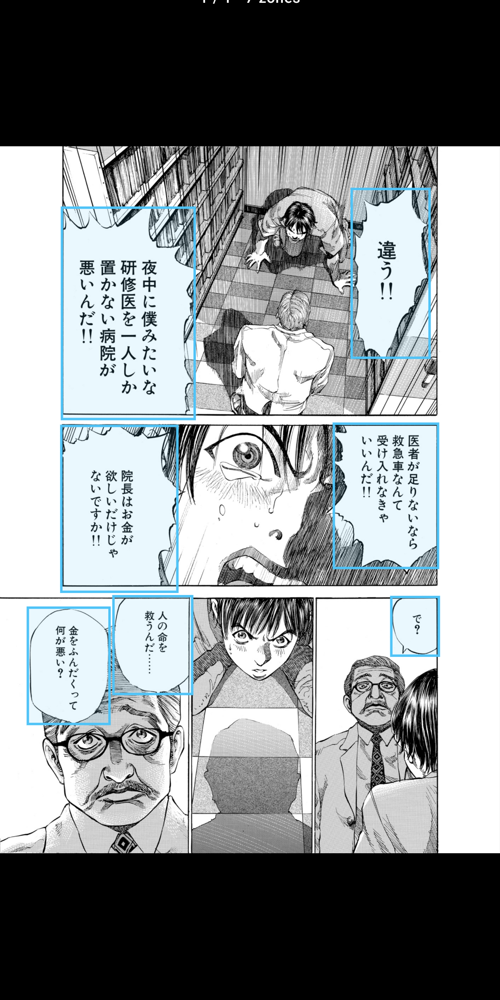
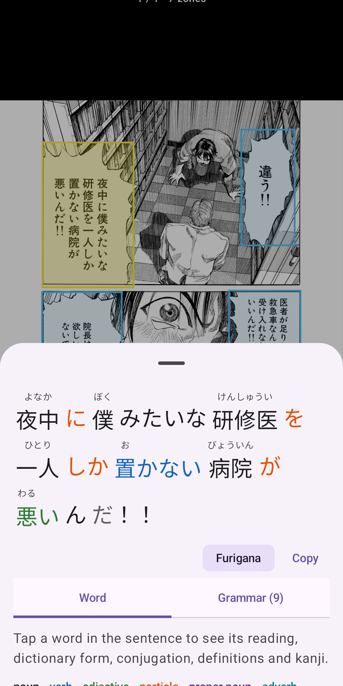
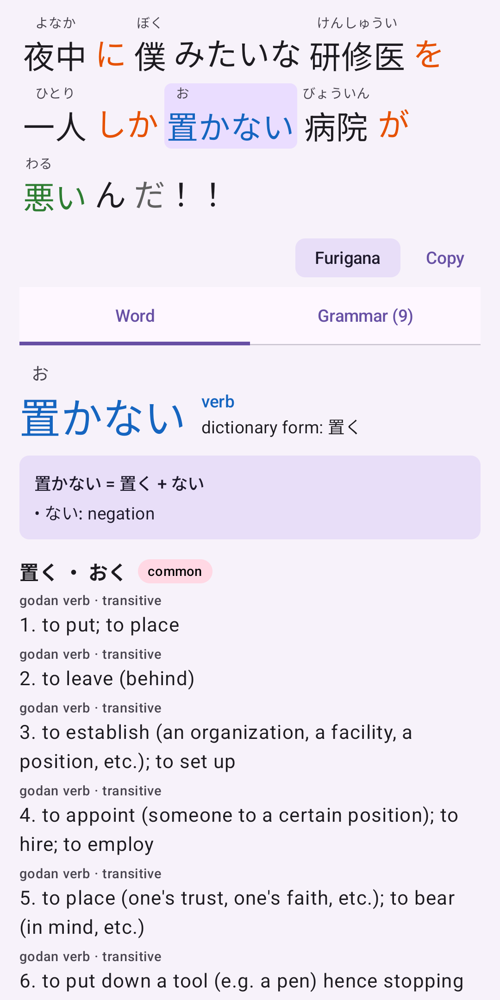
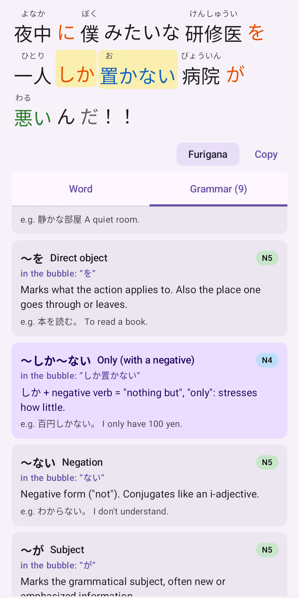

<p align="center"></p>

<h1 align="center">吹き出し Fukidashi</h1>

<p align="center"><b>English</b> · <a href="README.fr.md">Français</a></p>

An Android app to read Japanese — manga, books — bubble by bubble, **offline**.

Open a page (image, CBZ archive, shared screenshot) or photograph a paper book: the speech
bubbles are detected, and tapping a bubble opens a study screen with furigana, tappable words
(reading, dictionary form, conjugation breakdown, definitions, kanji) and the grammar points
of the sentence, explained in English or French.

Everything runs on the phone: on the NPU of Snapdragon chips (ONNX Runtime + Qualcomm QNN),
otherwise on the CPU.

<p align="center">
  
  
  
  
</p>

<p align="center"><sub>Sample page: “ブラックジャックによろしく” by 佐藤秀峰 (Shūhō Satō), free for reuse
(<a href="https://densho810.com/free/">terms</a>).</sub></p>

| On a Galaxy S25 Ultra | Snapdragon NPU | CPU only |
|---|---|---|
| Bubble detection (one page) | 60 ms | 1.2 s |
| Reading one bubble | 50 ms | 360 ms |

## Languages

The app is available in **English** (default) and **French**; on Android 13+ the language can be
chosen per app in the system settings. Grammar explanations, word roles and dictionary labels are
translated; definitions come from JMdict (English, plus French when available).

## Layout

| Folder | Contents |
|---|---|
| `export/` | Python scripts: model conversion to ONNX, reference implementations, dictionary build, store graphics |
| `android/core/` | Pure Kotlin processing (detection, OCR, Japanese analysis, grammar), tested on the JVM |
| `android/app/` | The app (Jetpack Compose, CameraX) |
| `android/models/` | Play asset pack (models + dictionary) |
| `docs/` | Privacy policy, Play Store listing and graphics |

## Building

Models and dictionary are not versioned; they have to be generated:

```bash
python3.12 -m venv .venv && .venv/bin/pip install -r export/requirements.txt
# YOLOv8 bubble detector (comic-speech-bubble-detector.pt) at the repository root
.venv/bin/python export/export_models.py
# JMdict / KANJIDIC2 from jmdict-simplified in export/data/ (see build_dictionary.py)
.venv/bin/python export/build_dictionary.py
```

Then, with the Android SDK:

```bash
cd android
./gradlew :core:test          # pipeline tests
./gradlew :app:assembleDebug  # development APK (models included)
./gradlew :app:bundleRelease  # Play Store AAB (models in the :models asset pack)
```

`android/bench.sh` measures performance on a connected phone.

## Licenses

Code under the **GNU AGPL-3.0** (see `LICENSE`), in particular because the bubble detector is a
YOLOv8 model (Ultralytics, AGPL-3.0).

Third-party components and data:
- [manga-ocr](https://github.com/kha-white/manga-ocr) (Maciej Budyś) — Apache 2.0
- [JMdict / KANJIDIC2](https://www.edrdg.org/edrdg/licence.html) (EDRDG), via
  [jmdict-simplified](https://github.com/scriptin/jmdict-simplified) — CC BY-SA 4.0
- [Kuromoji](https://github.com/atilika/kuromoji) + IPADIC — Apache 2.0 / IPADIC license
- [ONNX Runtime](https://onnxruntime.ai) — MIT; Qualcomm AI Engine Direct (QNN) — Qualcomm license
- Jetpack Compose, CameraX — Apache 2.0
